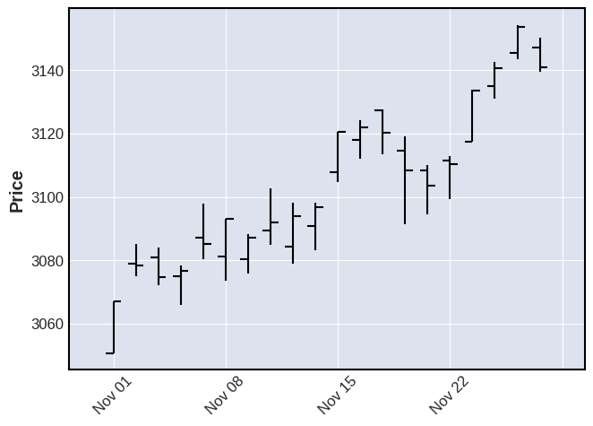
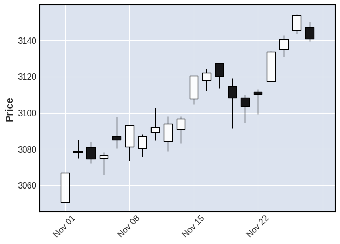
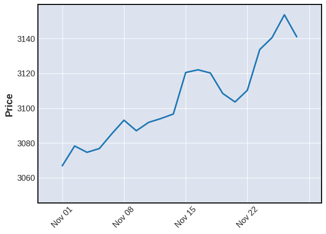
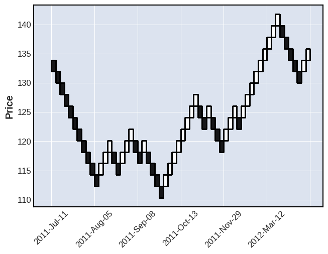
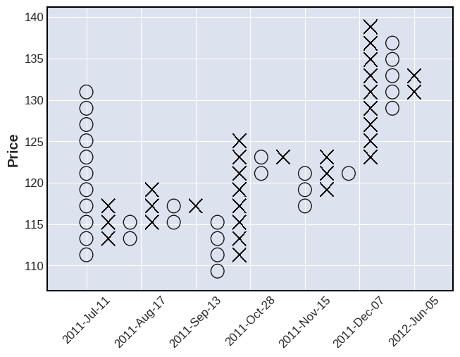
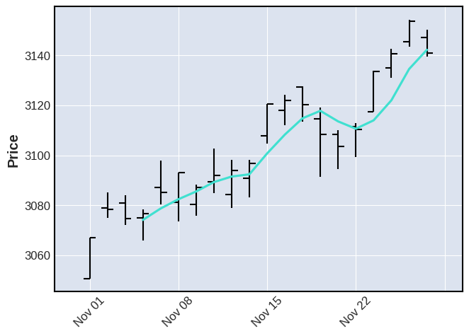
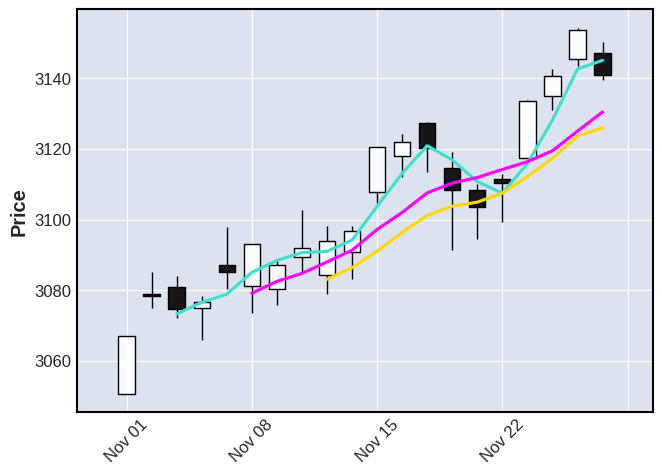
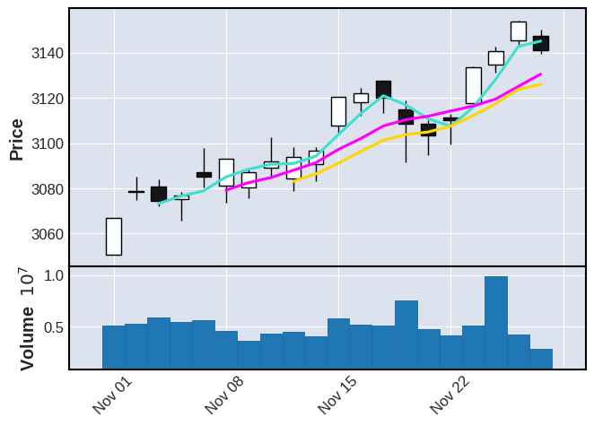
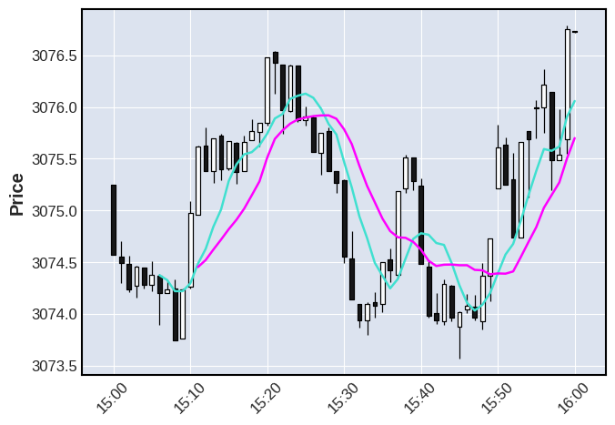
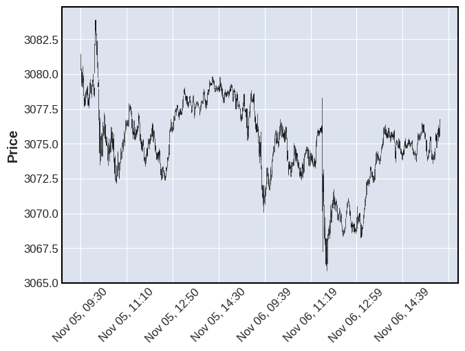

## 王诗薇 WANG Shiwei

## More projects can be found on my GitHub home page: [https://github.com/wswvv](https://github.com/wswvv)

```python
# 导入依赖环境
import numpy as np
import pandas as pd
import mplfinance as mpf

```


```python
# 读取测试数据
daily = pd.read_csv('data/SP500_NOV2019_Hist.csv',index_col=0,parse_dates=True)
daily.index.name = 'Date'

# 显示数据基本信息
daily.shape
daily.head(3)
daily.tail(3)
```


<div>
<style scoped>
    .dataframe tbody tr th:only-of-type {
        vertical-align: middle;
    }

    .dataframe tbody tr th {
        vertical-align: top;
    }

    .dataframe thead th {
        text-align: right;
    }
</style>
<table border="1" class="dataframe">
  <thead>
    <tr style="text-align: right;">
      <th></th>
      <th>Open</th>
      <th>High</th>
      <th>Low</th>
      <th>Close</th>
      <th>Volume</th>
    </tr>
    <tr>
      <th>Date</th>
      <th></th>
      <th></th>
      <th></th>
      <th></th>
      <th></th>
    </tr>
  </thead>
  <tbody>
    <tr>
      <th>2019-11-26</th>
      <td>3134.85</td>
      <td>3142.69</td>
      <td>3131.00</td>
      <td>3140.52</td>
      <td>986041660</td>
    </tr>
    <tr>
      <th>2019-11-27</th>
      <td>3145.49</td>
      <td>3154.26</td>
      <td>3143.41</td>
      <td>3153.63</td>
      <td>421853938</td>
    </tr>
    <tr>
      <th>2019-11-29</th>
      <td>3147.18</td>
      <td>3150.30</td>
      <td>3139.34</td>
      <td>3140.98</td>
      <td>286602291</td>
    </tr>
  </tbody>
</table>
</div>


```python
# 绘制OHLC图
mpf.plot(daily)

```





```python
# 使用箱线图绘制数据
mpf.plot(daily,type='candle')

```





```python
# 使用线形图绘制数据
mpf.plot(daily,type='line')
```





```python
# 读取横坐标数据
year = pd.read_csv('data/SPY_20110701_20120630_Bollinger.csv',index_col=0,parse_dates=True)
year.index.name = 'Date'

```


```python
# 绘制year-price的renko图
mpf.plot(year,type='renko')


```





```python
# 绘制PNF图
mpf.plot(year,type='pnf')


```





```python
# 使用mav参数绘制移动平均线
# 在数据中添加平均线
mpf.plot(daily,type='ohlc',mav=4)

```





```python

# 不同移动范围内的移动平均线
mpf.plot(daily,type='candle',mav=(3,6,9))

```





```python

# 多数据表融合
mpf.plot(daily,type='candle',mav=(3,6,9),volume=True)
```





```python


# 绘制日内交易数据
## 上述数据框包含标准普尔500指数2019年11月5日、6日、7日和8日的开盘、高点、低点和收盘数据，
## 每1分钟一次。让我们看看11月6日最后一个交易小时，7分钟和12分钟的移动平均线。
intraday = pd.read_csv('data/SP500_NOV2019_IDay.csv',index_col=0,parse_dates=True)
intraday = intraday.drop('Volume',axis=1) # Volume is zero anyway for this intraday data set
intraday.index.name = 'Date'

```


```python

# 绘制日内数据波动图
iday = intraday.loc['2019-11-06 15:00':'2019-11-06 16:00',:]
mpf.plot(iday,type='candle',mav=(7,12))


```





```python
# 显示日期的跨日数据波动图
iday = intraday.loc['2019-11-05':'2019-11-06',:]
mpf.plot(iday,type='candle')

```




